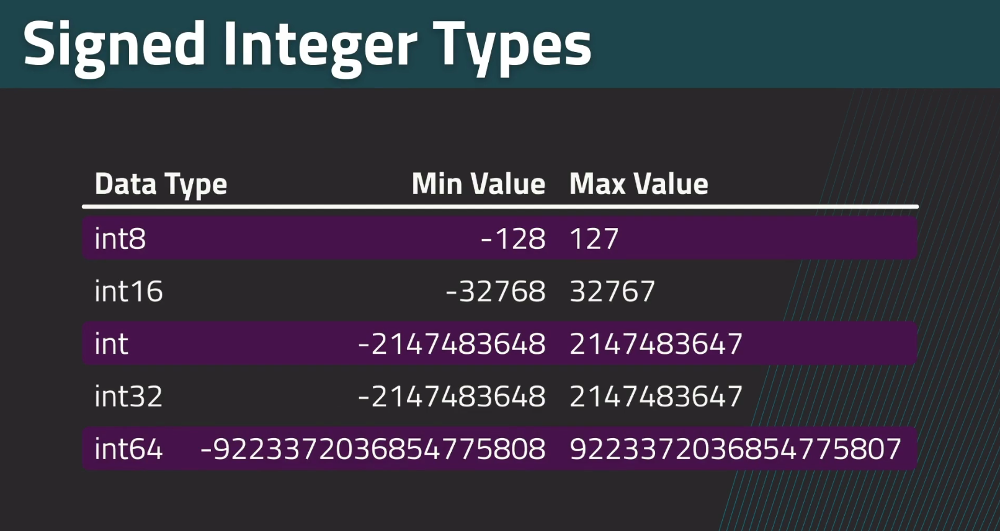
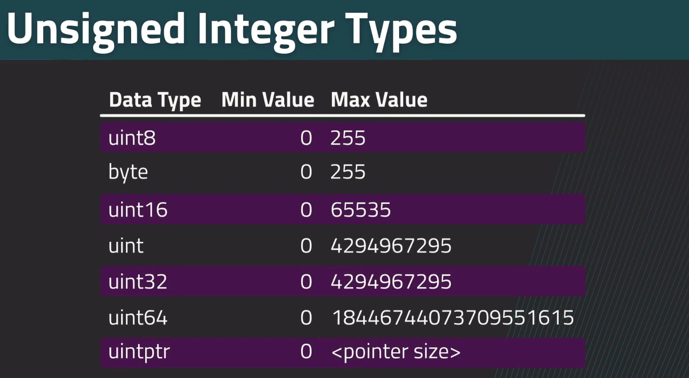
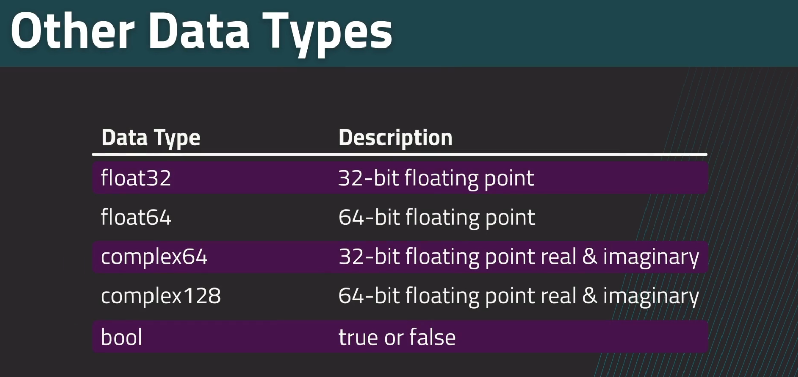
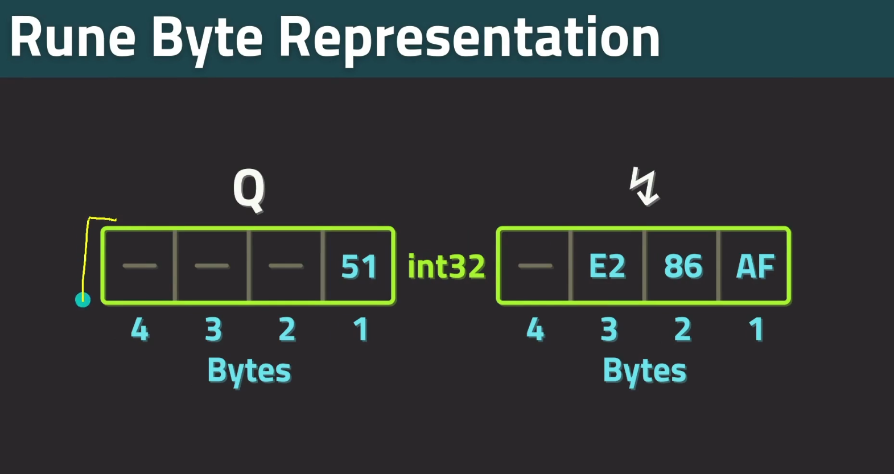
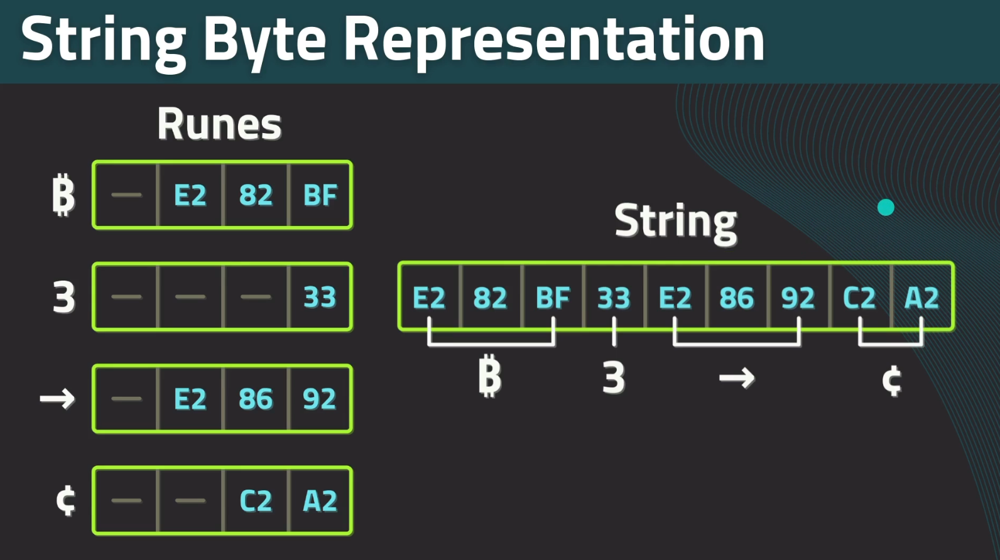

## Data Types 

- All data in computers is represented by binary digits(1s and 0s). These numbers don't make much sense to us humans.
- Data types are way through which a program can interpret these binary numbers.
- There are different data types like numbeers(1,2,1.3), strings("abc") etc.
- Go is a statically typed language so data types must be provided by programmers.
- Also Go uses type inference to automatically determine type of data used but we still have to provide types in specific circumstances.
- If we provide data type in Go, that type must be used or else type error is raised by the compiler.


### Primitive data types 

- All primitive data types in Go are numeric i.e streams of bytes.
- Due to this there can be error sometimes when taking user input or manually inputting byte stream.

__Some basic Go datatypes are :-__











### Type Aliases

- Like C `typedef` we can use type aliases in Go.
- These aliases perform same functionality as the original data type but have a different name.
- We can also type alias type aliases.


Syntax for type aliasing is :

```go
type newName oldName
type UserId int
type Speed float32
type Velocity Speed
```

Here Both old an new type will coexist.

To convert types to type alias type we have to use parentheses.

Eg : 

```go
UserId(10)
Speed(13.32)
```

### Text in GO

- Text in Go is represented in UTF-8 formatting.
- Go has a special data type known as `rune` which is basically alias for `int32`.
- The `rune` type is like `char` from C.
- `rune` will always print its numeric value until correct formatting is done.
  




#### Strings

- Strings in Go are collections of runes just like string in C is collection of chars.
- Strings are arrays of bytes with a length.
- There is no null termination of strings in Go.
- When we iterate through a string normally, we iterate through bytes and individual bytes are not symbols.





To create strings we can use following syntax :

```go
Runes : 'a', 'v','$','\n'
Strings : "apple","root","a","new\n"
Raw literals : `Hello this is a raw string\n`
```

Runes are created using single quotes though we have to use backticks for some letters which are not present on keyboard. Escape symbols like `\n` cannot be used with backticks , they are alsways used with single quotes.

Strings are created using double quotes. In above example `"a"` is also a string not a rune.

Raw literals are strings created using backticks. Escape symbols are presented as it is inside raw literals and any quotes can be used inside them. Note that raw literal and runes are different. A single escape character inside backticks will be treated as rune while if one more chracter is added to that string, it will be invalidated.

Eg :
```go 
`\n` -> rune, will result in new line character
`a\n`,`\n\n` -> raw literal, no effect of escaping
```